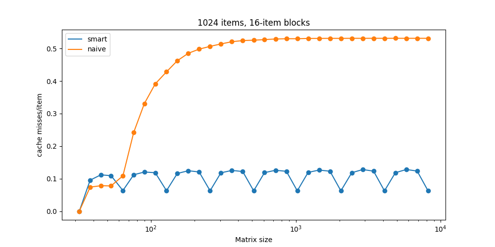
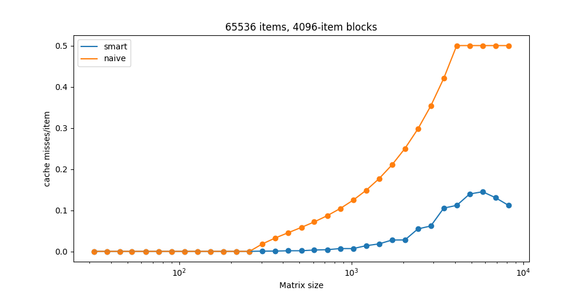
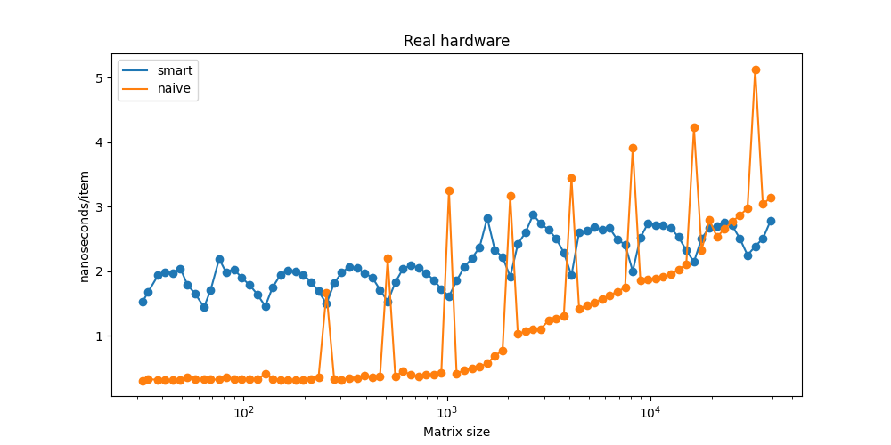
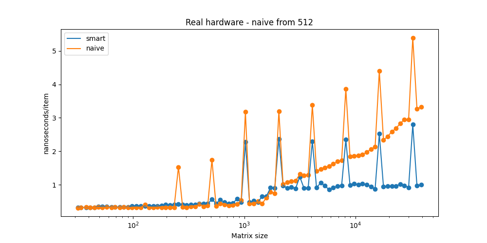
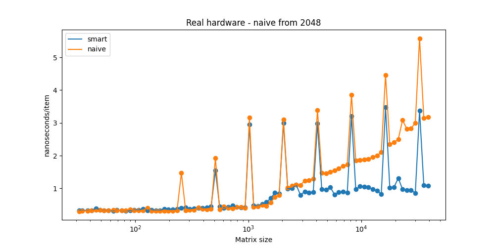
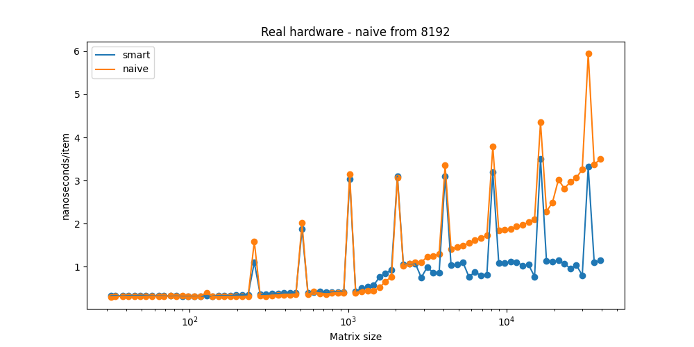

# Matrix experiment

## Cache Sim

### 1024 items, 16 item blocks
We can see that naive and smart algorithms are roughly comparable up to around 50x50=2500 matrices. Up to this point almost the whole matrix fits in the cache, so we would expect each cache-line to miss only once. 

There are 1024/16 = 64 cache-lines, so that would be 64 cache-misses in total. We are swapping roughly 2500 items, so the optimal number of cache-misses per swap would be 64 / 2500 ~= 0.25.
The observed cache-miss rate is a bit higher - around 0.1, which is probably caused by bad alignment of matrix rows and by the fact that for the small matrices the block size is comparable to matrix size.

We can also see periodicity in the smart algorithm cache miss rates. This is probably caused by bad alignment of the matrix in simulated memory (it is small for n=128, 256, 512 which are multiples of block sizes), or by other reason caused by the sim implementation.  I have not studied the Sim code thoroughly, so I cannot tell. 

#### 

### 8192 items, 64 item blocks
The cache misses of the naive algorithm explode from around 100*100 = 1e4 matrices. That is the point where the matrices no longer fit in the 8192 items cache. Before that, expected cache miss rate per swap is (8192/64)/10000 = 0.0128, which agrees with what we see. 

####

### 65536 items, 256 item blocks
While naive cache miss rate goes to 0.5 for large matrices regardless of the cache parameters, naive algorithm cache-miss rate stays constant with matrices of larger sizes. Larger (slim) caches make the smart algorithm more effective. 

The observed 0.5 cache miss rate for the naive algorithm can be explained by the fact, that the inner cycle of the algorithm sequentially scans through the colum of the matrix, so entire line needs to be fetched at every cycle iteration despite only 1 item being neeeded. The colums sizes it scans through range from 0 up to n-1.

When the matrix is sufficiently big - meaning number of rows is larger than the number of cache-lines, than there are many columns, which have sizes bigger the number of cache-lines, so after scanning through each of this large column, the entire cache is overwritten.

#### 

### 65536 items, 4096 item blocks
Naive algorithm doesn't explode as quickly as in the previous test, becaues each block is so large, it can fit in multiple rows (for matrices smaller than 4096*4096).
Large blocks are a bit of a disadvantage for the smart algorithm, which expects slim cache, therefore we can see significantly larger miss rate compared to 65536-256 cache from the previous example. 

####

## Real hardware
### Full recursion
If we try to run the same code used for the SimCache, we see that the naive algorithm is much faster than the smart one. That is because the running time of the smart alg is dominated by the overhead of recursive calls. 
####

### Hybrid alg
Switching from recursive to naive strategy at the right time proves crucial for good performance. Following figures compare the running-time of hybrid algorithm with various switch thresholds ranging from 128 up to 8192, where algorithm switches from recursive to naive strategy, when the number of swaps is smaller than the threshold.

The best performance is achived for threshold=128.

There are also some wierd spikes for matrices with sizes 2^k. I have no idea what those are caused by.

### Naive from 128

### Naive from 512 

### Naive from 2048

### Naive from 8192

