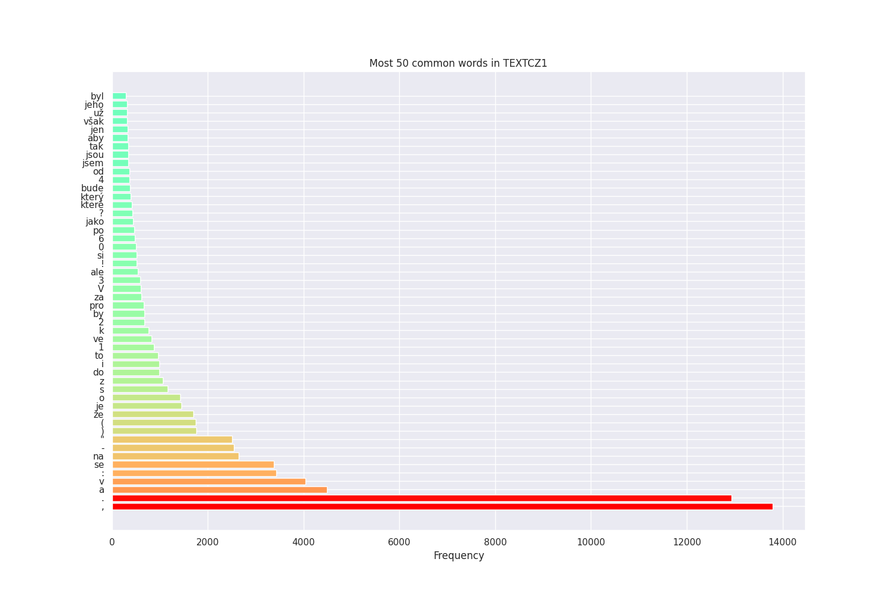
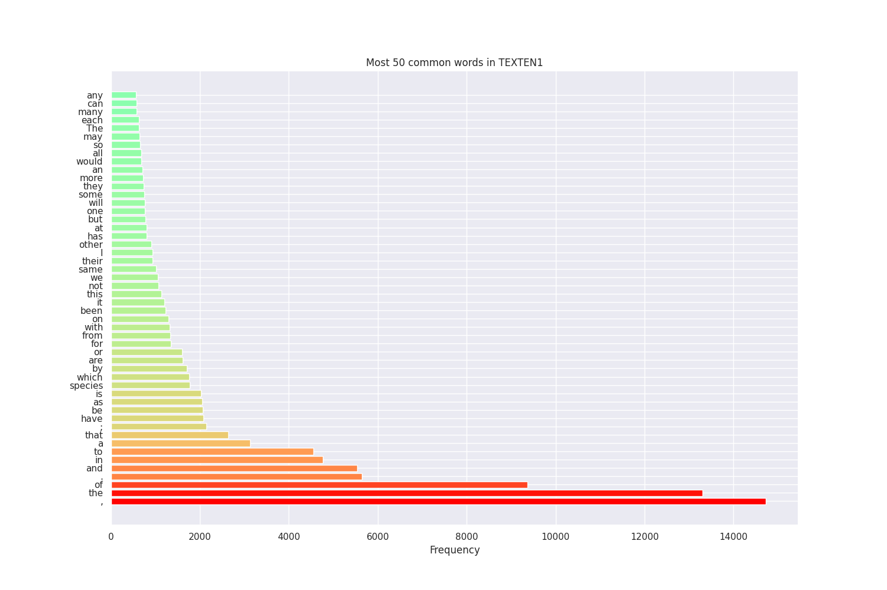
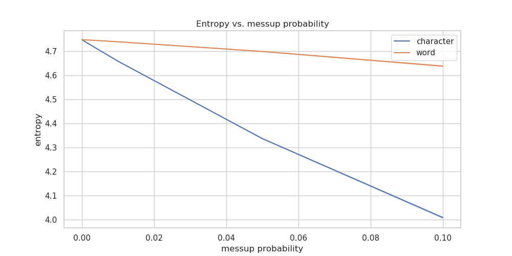
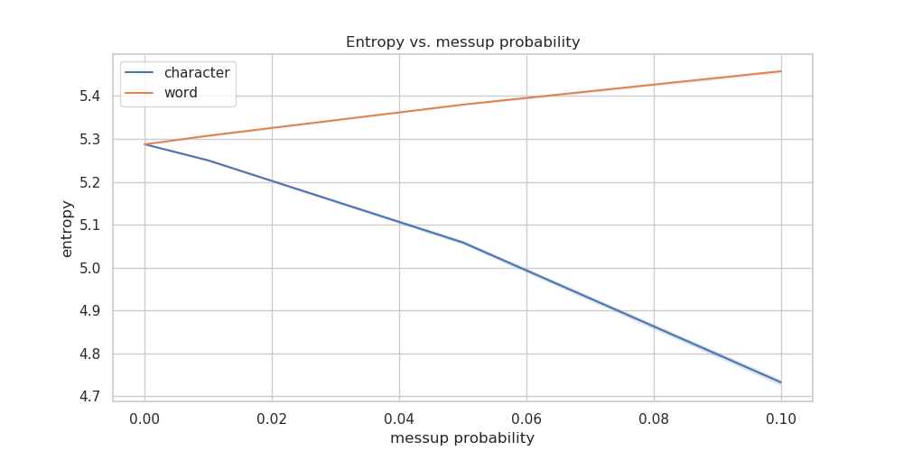

# Entropy of a Text (coding part 1)
In this experiment, you will determine the conditional entropy of the word distribution in a text given the previous word. To do this, you will first have to compute $P(i,j)$, which is the probability that at any position in the text you will find the word $i$ followed immediately by the word $j$, and $P(j|i)$, which is the probability that if word $i$ occurs in the text then word $j$ will follow. Given these probabilities, the conditional entropy of the word distribution in a text given the previous word can then be computed as:

$$H(J|I) = -\sum_{i \in I,j \in J}P(i,j)\log_{2}P(j|i)$$

Perplexity is then computed simply as:

$$PX(P(J|I)) = 2^{H(J|I)}$$

Compute this conditional entropy and perplexity fo the file **TEXTEN1.txt**

This file has every word on a separate line. (Punctuation is considered a word, as in many other cases.) The i,j above will also span sentence boundaries, where i is the last word of one sentence and j is the first word of the following sentence (but obviously, there will be a fullstop at the end of most sentences).

Next, you will mess up the text and measure how this alters the conditional entropy. For every character in the text, mess it up with a likelihood of 10%. If a character is chosen to be messed up, map it into a randomly chosen character from the set of characters that appear in the text. Since there is some randomness to the outcome of the experiment, run the experiment 10 times, each time measuring the conditional entropy of the resulting text, and give the min, max, and average entropy from these experiments. Be sure to use srand to reset the random number generator seed each time you run it. Also, be sure each time you are messing up the original text, and not a previously messed up text. Do the same experiment for mess up likelihoods of 5%, 1%, .1%, .01%, and .001%.

Next, for every word in the text, mess it up with a likelihood of 10%. If a word is chosen to be messed up, map it into a randomly chosen word from the set of words that appear in the text. Again run the experiment 10 times, each time measuring the conditional entropy of the resulting text, and give the min, max, and average entropy from these experiments. Do the same experiment for mess up likelihoods of 5%, 1%, .1%, .01%, and .001%.

Now do exactly the same for the file **TEXTCZ1.txt** which contains a similar amount of text in an unknown language (just FYI, that's Czech [*])

Tabulate, graph and explain your results. Also try to explain the differences between the two languages. To substantiate your explanations, you might want to tabulate also the basic characteristics of the two texts, such as the word count, number of characters (total, per word), the frequency of the most frequent words, the number of words with frequency 1, etc.

Attach your source code commented in such a way that it is sufficient to read the comments to understand what you have done and how you have done it.

---

# Results
## Basic language statistics

|Language|Dataset size|Number of unique words|Number of words occurring only once
|-|-|-|-|
|Czech|222413|42827|26316|
|English|221099|9608|3812|

Czech language has much richer morphology compared to English. In Czech language, one word can usually take on a large number grammatically correct forms, making the set of all possible valid word forms much larger than that of English.

This is apparent in the _Number of unique words_ statistic, which is more than 4 times larger for Czech than it is for English.

Similarly, the rich morphology is also reflected in the _Number of words occuring only once_ statistic - where there is 7x difference between those two languages.

### Bar plot of Top-50 most common words

#### Few observations
1. Punctuations (`.`) are more common in Czech language, suggesting that the average Czech sentence is shorter than the English one.
2. The use of special symbols like `(, ), -, -, :` is more common for the Czech dataset
3. Whereas Czech has digits `0, 1, 2, 3, 4, 6` in its top 50 words, the English doesn't have any digit characters in its top-50 list (there is a word `one` in the list thought)

## Entropy, perplexity)

### Czech

Messup type|Messup prob|Entropy mean|Entropy min|Entropy max|Perplexity mean|Perplexity min|Perplexity max
|-|-|-|-|-|-|-|-|
character|0.0|4.747830945558377|4.747830945558377|4.747830945558377|26.868259177620114|26.868259177620114|26.868259177620114
character|1e-05|4.74771182112168|4.747587951770265|4.747796199591923|26.86604076505493|26.86373412547998|26.867612088412976
character|0.0001|4.746895248999014|4.7466662435906875|4.747200646064727|26.85083892365767|26.84657691971887|26.85652325919384
character|0.001|4.7382511991094685|4.736907205758305|4.739110579233642|26.69044268462023|26.665587441564174|26.70634389793559
character|0.01|4.6581428396786455|4.655832200022488|4.660712595310665|25.24881474638167|25.20839219291679|25.293812354173056
character|0.05|4.336964415307164|4.334520375552728|4.339747306481703|20.209556754136145|20.17533013102757|20.248558580930087
character|0.1|4.009074595548222|4.003593999186806|4.013968437147944|16.100992965486082|16.039908415144563|16.15566730880703
word|0.0|4.747830945558377|4.747830945558377|4.747830945558377|26.868259177620114|26.868259177620114|26.868259177620114
word|1e-05|4.747817580507374|4.747761585746187|4.747872015884386|26.868010278767873|26.866967475242877|26.869024068216905
word|0.0001|4.747757785717636|4.7476087882908695|4.747864509674422|26.866896750320524|26.86412211516313|26.868884271512947
word|0.001|4.7470695033988735|4.746727647892731|4.747481056852172|26.85408238357443|26.847719593917926|26.86174376008998
word|0.01|4.739222303586763|4.737809577135863|4.740582010083204|26.708417598550255|26.68227134838171|26.733596077791358
word|0.05|4.698993892777226|4.69691122479825|4.701762279097213|25.973970077400036|25.936487804101635|26.02384589278968
word|0.1|4.638169173409364|4.633841550413742|4.642131299518176|24.90168074401169|24.827060458710562|24.970127790754663

### English

Messup type|Messup prob|Entropy mean|Entropy min|Entropy max|Perplexity mean|Perplexity min|Perplexity max
|-|-|-|-|-|-|-|-|
character|0.0|5.2874846405274205|5.2874846405274205|5.2874846405274205|39.05633421084705|39.05633421084705|39.05633421084705
character|1e-05|5.287458284521222|5.287365141815407|5.287518542286584|39.05562072789242|39.05309930103211|39.05725200286547
character|0.0001|5.287033508626451|5.286644105210353|5.2872426345037935|39.04412342164779|39.03358604433767|39.049783224560464
character|0.001|5.283812864627775|5.2824584382303845|5.284926841368938|38.95706258878103|38.92050267710131|38.98715136077336
character|0.01|5.250066457057137|5.247225744592146|5.252239212048611|38.05641213886297|37.98152018909365|38.113738262596975
character|0.05|5.058783843507143|5.05389154096547|5.064145702475497|33.330877446249396|33.217959301303615|33.454901755551404
character|0.1|4.732797542581993|4.725116864500953|4.740007446063153|26.589878947648835|26.44855254063063|26.722951344320855
word|0.0|5.2874846405274205|5.2874846405274205|5.2874846405274205|39.05633421084705|39.05633421084705|39.05633421084705
word|1e-05|5.2874932946907|5.287448294002151|5.2875276108201446|39.05656849998282|39.0553502578172|39.05749751082365
word|0.0001|5.2876990908301975|5.287605017305358|5.287836680943516|39.062140238683284|39.05959316141203|39.06586573721266
word|0.001|5.289390107808867|5.288790317599533|5.289901934317892|39.107953949912584|39.09169722347897|39.121829530437765
word|0.01|5.307607790228046|5.305000483980068|5.309055604832067|39.60493660345087|39.5334096503095|39.644686298323194
word|0.05|5.379988385368776|5.378007951926059|5.382309861261614|41.642625338238545|41.58547921107922|41.70966619723279
word|0.1|5.457836045908288|5.453280339469338|5.460902566780672|43.95143229453386|43.812794741319685|44.04488455445509

We can see that English has generally higher entropy than Czech. That is probably because Czech has much more words with frequency=1. When we take a look back a the top-50 words distribution, English histogram is closer to a uniform distribution (even though still far off), or said differently, Czech word frequency distribution is more extreme, dropping off faster in the frequencies.

When we introduce character-level noise, we will in many instances create new, grammatically incorrect word forms, which results in more words occuring only once. This is probably the reason behind the entropy decreasing with the increasing messup probability.

In the case of word-level noise the situation is not that clear. We have two effect going aginst each other. Introducing random words has equalizing effect on the distribution, which should increase entropy. But it may also happen, that we lose many of the words occuring only once in the process, decreasing the vocabulary size and lowering the entropy.

For English, the equalizing effect dominates, because it doesn't have that many words occuring only once, so the overall entropy increases. 
On the other hand, Czech has many words occuring only once in the original dataset, so it looses much more unique words by the random word swap, which ultimately results in the overall increase of entropy.

# Theoretical paper-and-pencil excercise (part 2)

Now assume two languages, $L_1$ and $L_2$ do not share any vocabulary items, and that the conditional entropy as described above of a text $T_1$ in language $L_1$ is $E$ and that the conditional entropy of a text $T_2$ in language $L_2$ is also $E$. Now make a new text by appending $T_2$ to the end of $T_1$. Will the conditional entropy of this new text be greater than, equal to, or less than $E$? Explain (This is a paper-and-pencil exercise of course!)

---
**We are given**:
- Languages $L_1$, $L_2$
- Language bigram distributions
    $$P_1(w_i, w_{i+1}), P_2(w_i, w_{i+1})$$

- and conditional word distributions given the previous word
    $$P_1(w_{i+1} | w_i), P_2(w_{i+1} | w_i)$$

- Vocabularies $V_1$, $V_2$, for which $V_1 \cap V_2 = \empty$
- Conditional entropies: 

    $$ H_1(J | I) = -\frac{1}{|T_1|}\sum_{(w_i, w_{i+1}) \in T_1}\log_{2}\frac{c_{2, T_1}(w_i, w_{i+1})}{c_{1, T_1}(w_i)} = H_2(J | I) = -\frac{1}{|T_2|}\sum_{(w_i, w_{i+1}) \in T_2}\log_{2}\frac{c_{2, T_2}(w_i, w_{i+1})}{c_{1, T_2}(w_i)} = E$$

    $$ H_1(J | I) = -\frac{1}{|T_1|}\sum_{(w_i, w_{i+1}) \in T_1}\log_{2} P_1(w_{i+1} | w_i)= H_2(J | I) = -\frac{1}{|T_2|}\sum_{(w_i, w_{i+1}) \in T_2}\log_{2} P_2(w_{i+1} | w_i) = E$$

**Question**: What is the conditional entropy of $T_3 = T_1 . T_2$?

To be able to compute conditional entropy, we first need to have a probability distribution $P(i)$ and $P(i, j)$. 
The task is to compute conditional entropy as described above, that is the entropy of a bigram language model, where the conditioning history is only one word.

So the $P_{3}(w_{i+1} | w_i)$ will be defined as:

$$P_{3}(w_{i+1} | w_i) = \frac{c_{2, T_3}(w_i, w_{i+1})}{c_{1, T_3}(w_{i+1})}$$

$$H_3(J | I) = -\frac{1}{|T_3|} \sum_{(w_i, w_{i + 1}) \in T_3} \log_2 P_3(w_{i+1} | w_i) = - \frac{1}{|T_1| + |T_2| + 1} (\sum_{(w_{i}, w_{i + 1}) \in T_1}{\log_2 \frac{c_{2, T_3}(w_i, w_{i+1})}{c_{1, T_3}(w_i)}} + \sum_{(w_{i}, w_{i + 1}) \in T_2}{\log_2 \frac{c_{2, T_3}(w_i, w_{i+1})}{c_{1, T_3}(w_i)}} + \log_2 \frac{c_{2, T_3}(w_{T_1, last}, w_{T_2, first})}{c_{1, T_3}(w_{T_1, last})}) = $$

$$=   \frac{(|T_1| + |T_2|)\cdot E }{|T_1| + |T_2| + 1} - \frac{1}{|T_1| + |T_2| + 1} \log_2 \frac{c_{2, T_3}(w_{T_1, last}, w_{T_2, first})}{c_{1, T_3}(w_{T_1, last})} =  \frac{(|T_1| + |T_2|)\cdot E }{|T_1| + |T_2| + 1} + \frac{\log_2 c_{1, T_1}(w_{T1, last})}{|T_1| + |T_2| + 1} $$

So the inequeality between $H_3(J | I)$ and $E$ exactly mirrors that of $log_2 c_{1, T_1}(w_{T_1, last})$ and $E$.

If the last word of $T_1$ is frequent in $T_1$, so much so, that $log_2 c_{1, T_1}(w_{T_1, last}) > E$ (or equivalently $c_{1, T_1}(w_{T_1, last}) > 2^E = \text{Perplexity}$), then $H_3(J | I) > E$.

Similarly, if the count of the last word in $T_1$ so small, that $log_2 c_{1, T_1}(w_{T_1, last}) < E$, then $H_3(J|I) < E$ 

Analogically with equality.
