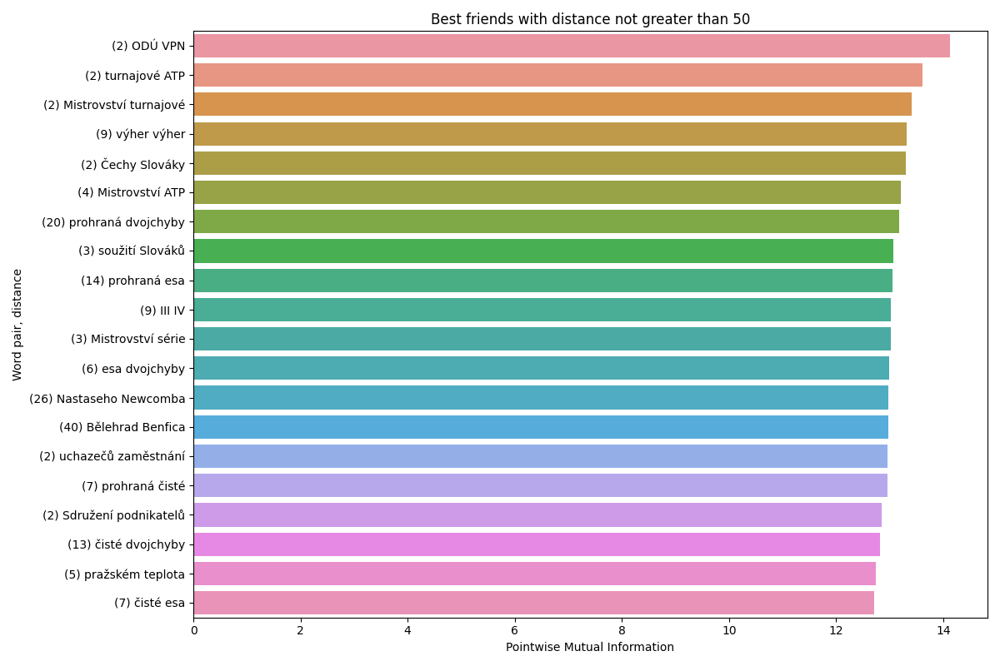

# Best Friends
In this task you will do a simple exercise to find out the best word association pairs using the pointwise mutual information method.

First, you will have to prepare the data: take the same texts as in the previous assignment, i.e.

**TEXTEN1.txt** and **TEXTCZ1.txt**

(For this part of Assignment 2, there is no need to split the data in any way.)

Compute the pointwise mutual information for all the possible word pairs appearing consecutively in the data, disregarding pairs in which one or both words appear less than 10 times in the corpus, and sort the results from the best to the worst (did you get any negative values? Why?) Tabulate the results, and show the best 20 pairs for both data sets.

Do the same now but for distant words, i.e. words which are at least 1 word apart, but not farther than 50 words (both directions). Again, tabulate the results, and show the best 20 pairs for both data sets.

## Best bigram friends

### Czech
#### Top 20 pairs
||||
|-|-|-|
|Hamburger|SV|14.28894391532341|
|Los|Angeles|14.06243538551473|
|Johna|Newcomba|13.762875103655821|
|Č.|Budějovice|13.633592086710856|
|série|ATP|13.468961384938057|
|turnajové|série|13.434404162901687|
|Tomáš|Ježek|13.428974367102384|
|Lidové|noviny|13.329915696379716|
|Lidových|novin|13.271022007326147|
|veřejného|mínění|13.06243538551473|
|teplota|minus|12.981515390131163|
|Ján|Čarnogurský|12.955520181598217|
|jaderné|zbraně|12.955520181598217|
|Milan|Máčala|12.89780468374193|
|lidských|práv|12.862870893632543|
|společném|státě|12.708427319633445|
|akciových|společností|12.692485775764423|
|Pohár|UEFA|12.625371579905886|
|privatizačních|projektů|12.615670178713593|
|George|Bushe|12.603003766877432|


#### Bottom 5 pairs
||||
|-|-|-|
|.|že|-6.6235915786332304|
|(|.|-6.66716059357063|
|na|.|-7.265268470348708|
|.|se|-7.617624736871417|
|,|.|-8.061834206716144|


### English

#### Top 20 pairs
||||
|-|-|-|
|La|Plata|14.169363948652101|
|Asa|Gray|14.031860424902167|
|Fritz|Muller|13.362009026594498|
|worth|while|13.33286268093498|
|faced|tumbler|13.262473353043582|
|lowly|organised|13.216892318734686|
|Malay|Archipelago|13.110470259598532|
|shoulder|stripe|13.053886731232165|
|Great|Britain|12.914550049623276|
|United|States|12.847435853764738|
|English|carrier|12.525507758877376|
|specially|endowed|12.401810034652472|
|Sir|J|12.377356990927932|
|branched|off|12.377356990927932|
|de|Candolle|12.362009026594498|
|mental|qualities|12.362009026594498|
|Galapagos|Archipelago|12.344935513235555|
|red|clover|12.323873897707726|
|self|fertilisation|12.31692113706596|
|systematic|affinity|12.251826108844075|


#### Bottom 5 pairs
||||
|-|-|-|
|a|,|-7.704130104707167|
|of|.|-7.901956776788321|
|.|of|-7.901956776788321|
|.|the|-8.407461564173527|
|the|,|-8.790291755302547|


## Best word pairs with distance greater or equal to 2 and less than 50
### Czech

|Distance|word 1|word 2| PMI|
|-|-|-|-|
|2|ODÚ|VPN|14.119018913881098|
|2|turnajové|ATP|13.614976408543509|
|2|Mistrovství|turnajové|13.410358688935036|
|9|výher|výher|13.318090260982926|
|2|Čechy|Slováky|13.303443485018525|
|4|Mistrovství|ATP|13.20390781146761|
|20|prohraná|dvojchyby|13.172198951740272|
|3|soužití|Slováků|13.06243538551473|
|14|prohraná|esa|13.051904718022561|
|9|III|IV|13.025909509489615|
|3|Mistrovství|série|13.02333556582579|
|6|esa|dvojchyby|12.987774380602845|
|26|Nastaseho|Newcomba|12.981515390131163|
|40|Bělehrad|Benfica|12.981515390131163|
|2|uchazečů|zaměstnání|12.955520181598217|
|7|prohraná|čisté|12.955520181598217|
|2|Sdružení|podnikatelů|12.855984508047303|
|13|čisté|dvojchyby|12.824275648319965|
|5|pražském|teplota|12.740507290627367|
|7|čisté|esa|12.703981414602254|



### English
|Distance|word 1|word 2| PMI|
|-|-|-|-|
|3|survival|fittest|13.754326449373258|
|2|dimorphic|trimorphic|13.353447013091072|
|3|Alph|Candolle|13.236478144510638|
|4|H|Watson|13.169363948652101|
|2|Alph|de|13.053886731232165|
|3|Old|Worlds|13.053886731232165|
|2|E|Forbes|12.946971527315654|
|3|unimportant|welfare|12.879857331457115|
|4|carrier|faced|12.695432760319688|
|2|rarer|rarer|12.525507758877376|
|2|plates|baleen|12.468924230511009|
|2|eastern|western|12.468924230511009|
|2|plains|La|12.432398354485894|
|2|supplant|exterminate|12.368895412179736|
|2|oscillations|level|12.362009026594498|
|2|F|sanguinea|12.303864984240512|
|2|analogical|adaptive|12.246531809174561|
|7|incidental|systems|12.205889824677215|
|2|beasts|prey|12.179417613316025|
|2|C|Watson|12.169363948652101|


## Conclusion
### PMI and it's meaning
Pointwise mutual information of words $x$ and $y$ is defined as follows:

$$pmi(x, y) = \log_2 (\frac{p(x, y)}{p(x)p(y)})$$

#### Zero PMI
Independence is probabilisticaly defined as $p(x,y) = p(x)p(y)$.
In our context, the probabilistic independence of two words gives $pmi(x,y) = \log_2 1 = 0$, which means that the occurence of the pair in the text isn't surprising and the word pair isn't special.

#### PMI > 0
This is equivalent to $p(x,y) > p(x)p(y)$, or in other words, the pair is more likely than we would expect based only on the individual word probabilities, suggesting a possible named entity or collocation.

For example:
```
Č. Budějovice
série ATP
turnajové série
Tomáš Ježek
Lidové noviny
Čechy Slováky

survival fittest
La Plata	
Asa Gray	
Fritz Muller	
worth while
```


#### PMI < 0
Negative pairs (in the PMI sense) point to words that don't like each other and placing them next to each other might be a grammatical mistake.

We **do** get pairs with negative PMI. For example:

**Czech**
```
na .
. se
, .
```

Where `, .` is obviously a grammatical nonsense.


**English**
```
a ,
of .
the ,
```
Similarily to Czech negative pairs, the English ones also correspond to grammatically incorrect phrases, hence the negative PMI.