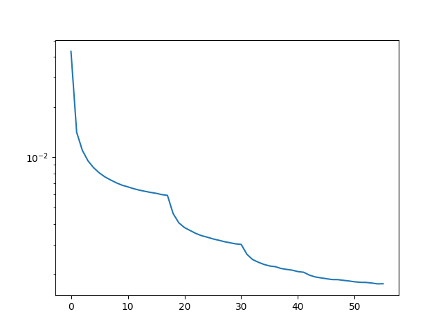

# Diacritizer

## Setup
```
$ pip install -r requirements.txt
```


## The architecture


## Training

```
$ python train.py --strip-prob 0.9 --epochs 4000 --max-sentences 100000 --exp-name larger-100k --n_conv_filters 256 --we_dim 256 --learning-rate 0.00032 --batch-size 150
```



## Inference

```
$ python inference.py --input data/diacritics-etest_stripped.txt --output test_dict.txt --checkpoint larger-100k_epoch_41 --n-iters 2 --use-dict
```

## Evaluation
```
$ python eval.py
$ xdg-open accuracy.png
```

### Comparing against CZACCENT

```
$ python compare.py --correct-file dtest_czaccent_gold.txt --pred-file dtest_pred_by_czaccent.txt 

Character accuracy: 14472/14585 = 0.9922523140212547
Word accuracy: 2159/2257 = 0.9565795303500222
```


## Interactive Web app
```
$ python server.py
```


